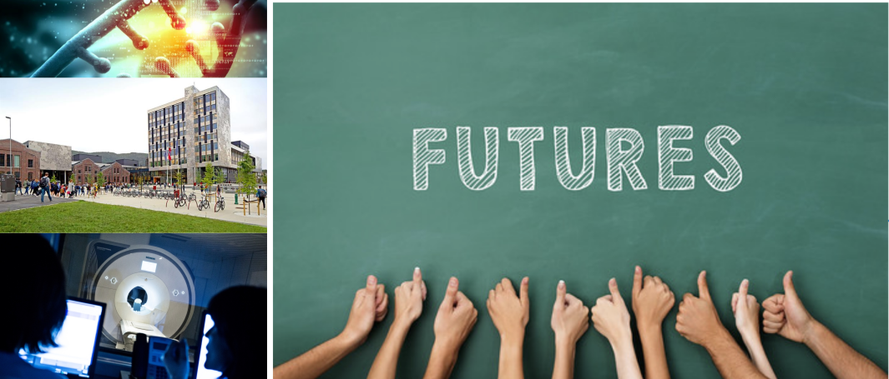

# HVL-MMIV-DLN-AI-2022: A hands-on course on artificial intelligence in computational biotechnology and medicine 

The [course](https://www.digitallifenorway.org/research-school/events/2022-a-hands-on-introduction-to-artificial-intelligence.html) belongs to the [Department of Computer science, Electrical engineering and Mathematical sciences](https://www.hvl.no/en/about/management/faculty-of-engineering-and-science/department-of-computer-science-electrical-engineering-and-mathematical-sciences-ny-side), Western Norway University of Applied Sciences, and is associated with the [Mohn Medical Imaging and Visualization Center](https://mmiv.no/).

  

Recent years have seen a surge of interest in machine learning and artificial intelligence. This is caused by highly visible breakthroughs in a variety of areas like computer vision, natural language processing, speech recognition and synthesis, and in the analysis of unstructured, tabular data. As many of the challenges faced in more general domains are transferable to specialized domains, we have seen a torrent of scientific publications and new applications across all data-driven fields, from medicine to physics, biology to cosmology. The course provides a practical, project-based, hands-on exploration of state-of-the-art techniques and software frameworks from machine learning and deep learning for solving real-world problems from biomedicine, biotech and related fields. It will be a guided tour of a useful, interesting and important landscape, pointing out theoretical and application-oriented gold-mines along the way. 

By the end of the course the participants will have a solid understanding of the ideas of machine learning, and good experience and practical intuitions around how the methods can be applied in biomedical domains, using modern tools and frameworks. They'll also be familiar with some challenges and limitations of applied machine learning.

<!--Sign up for the course [here](https://www.survey-xact.no/LinkCollector?key=2LAGQW7TJ195).-->

For questions about the course, contact course coordinator [Alexander S. Lundervold](https://www.hvl.no/en/employee/?user=3610493) or the DLN research school via [Rosalie Zwiggelaar](mailto:rosalie.zwiggelaar@ntnu.no)

 The content for the course is offered with a <b><a href="http://creativecommons.org/licenses/by-sa/4.0">CC BY-SA 4.0</a></b> license unless otherwise stated.

______________________________________________________

# Course schedule

The course will run from April 25th to June 7th. The course is hybrid. From Monday 
May 2nd until Wednesday May 4th we will meet in Bergen, at the MMIV centre. The remainder of the course lectures will be given via Zoom. 

The schedule will be updated throughout the course (except for the timing of the 
physical lectures in Bergen, which is fixed).

| Day       |  Content
|------------|------------
|**Monday, April 25th**|                                                  
|10:15-12:00 | Lectures about the course: its motivation and objectives. [Link to slides](https://docs.google.com/presentation/d/e/2PACX-1vScKhVvck2fd3jUY_Z8N6r7xm5uPuDfjlsCAGLBxer2N16iHTXccSa19frHp9FTPPJx5ZPR6QjHRbfx/pub?start=false&loop=false&delayms=3000).
|**Week 16, April 26&ndash;29**|                                                
|On your own | [Getting started](0-getting_started)
|**Monday May 2nd, in Bergen**| _Location announced on Discord_                                              
|~09.45| We gather at a location to be announced 
|10:30-11:45 | [Individual project pitch](project_pitch) 
|12:00-14:00 | [Getting started on the team project](team_project)                                                  
|14.00-15.00 | Lunch will be served (details on Discord)                                                 
|15:00-| Discussions about the [team projects](team_project) organized by each team 
|**Tuesday May 3rd, in Bergen**| _Location announced on Discord_  
|09.15-12.00 | [A hands-on tour of deep learning, Part 1](1-deep_learning) 
|13.15-15.00 | Working on the [team project](team_project)                                                  
|**Wednesday May 4th, in Bergen**| _Location announced on Discord_  
|09.15-12.00 | [A hands-on tour of deep learning, Part 2.1](1-deep_learning)  
|09.15-12.00 | [Biomedical imaging in time and space, Part 1](2-biomedical_imaging)  
|**Monday May 9th** | 
|09.15-12.00 | [Biomedical imaging in time and space, Part 2](2-biomedical_imaging) 
|**Friday May 13th** | 
|09.15-12.00 | [A hands-on tour of deep learning, Part 2.2](1-deep_learning) 
|**Thursday May 19th**|                                                  
|10:15-12:00 | _TBA_|
|**Week 21**|                                                  
|On your own | Work on [team project](team_project)
|**Wednesday June 1st**|                                                  
|09:15-12:00 | Team project presentations 
|**Thursday June 2nd**|                                                  
|16.00 | Team project deadline 
|**Monday June 6th**|                                                  
| | Feedback on team project
|**Tuesday June 7th**|                                                  
|10:15-12:00 | Digital exam (pass/fail)

______________________________________________________
